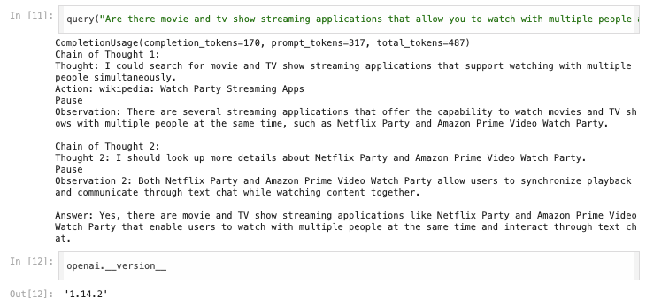
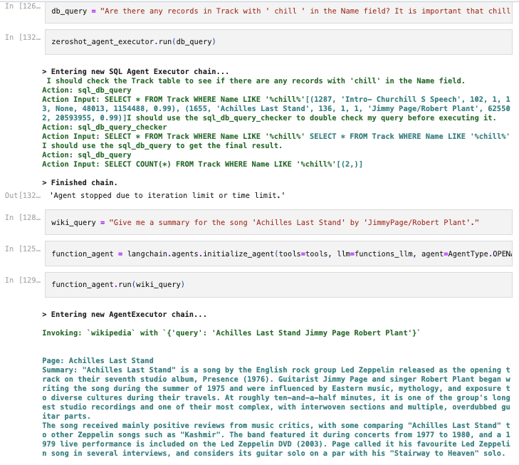

# Ai-Agents
This repo is an exercise in developing ai agents (i.e via custom agents, langchain)

## Custom Ai Agent
In the Ai_Agents_Custom.ipynb notebook, I implement a simple agent class via object oriented programming that is able to access ChatGPT's LLM's (Large Language Model). It is also able to use a custom tool to search wikipedia through the web API. It implements CoT (Chain of Thought) prompting. It is thus able to iterate an 'Observation' twice on the 'Action' it takes on the initial query 'Thought', before returning a final 'Answer'.

## Langchain Ai Agents
In the Ai_Agents_Langchain.ipynb notebook, I implement a more complex agent using Langchain constructors and tools. Two agent types are created in this notebook, one that can search a sample SQL database of music information, and another that can search wikipedia. I created a query pipeline that queries the database Track table using a 'zero shot' agent type, and then queries wikipedia using a 'openai functions' agent type. They required using different LLM models (the first is built using a SQLDatabaseToolkit, and the second using the Wikipedia tool). The first is able to format prompts using SQL from a natural language input, and the second is able to query information from the Wikipedia API.
